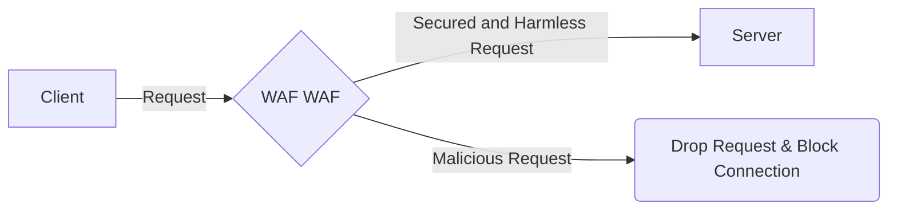

# WAF WAF V1.1
<div align="center">

</div>

# Summary
WAF WAF is an open-source advanced web application firewall that works with a smart and new detection technology, achieving 99% of precise answers!<br>
With an interactive CLI you can easily scan weaknesses on your local network, configure WAF WAF, and see what is happening on your server.

## Installation
WAF WAF is running on a [docker](https://docs.docker.com/), so use the following command to install it:

```bash
docker pull wafwafdetective/waf_waf:V1.1
```

## Usage
Can be found in the [WAF WAF Manual](https://gitlab.com/magshimim-markez-2021/10/1003/pardes-hana-1003-waf/-/blob/fifth_sprint/manual/manual.md), or in the docker at `waf_waf/manual/manual.md`.

## Features & Technology
At the end of each day, an email attached with a detailed log will be sent, containing information about all the attempted attacks on the server.<br>

WAF WAF Version 1.1 is capable of protecting servers from the following attacks:
- Brute Force
- Command Injection
- File Inclusion
- SQL Injection
- XSS
- XXE


## Flow


## WAF WAF Automation
Still not convinced WAF WAF is the best?<br>
Click [here]() to download a VM we have made for you, showing what WAF WAF can really do.

# Contact
We would like to hear reviews about WAF WAF!<br>
Contact us at [wafdetectivebot@gmail.com](mailto:wafdetectivebot@gmail.com).

### All rights reserved to our developers, Noam Mizrahi & Ron Konis
