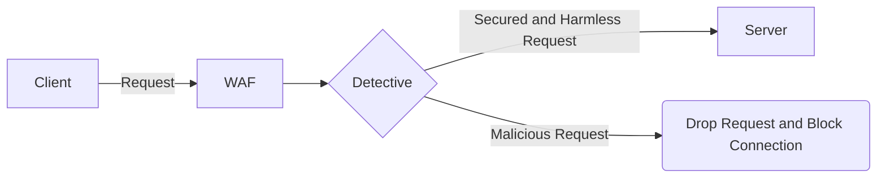

# WAF V1.0

# Summary
Our WAF is a regex based proxy. This means that all the requests that should go into a server will  
first pass through the WAF, and detection operations will be applied on them using regex queries. 

## Features & Technology
Our project works with smart and new detection technology, that achieves 99% of precise answers! 
WAF Version 1.0 protects a server from couple of web attacks:
- SQL Injection
- XXE (XML External Entities)

In addition, at the end of each day an email attached with a detailed log will be sent, 
containing information about all the attempted attacks on the server.

## Project's Flow

## Future Expectations
More WAF versions will come out very soon. Wait for them! 
The next versions will include:
- Advanced detections of more web attacks
- Local network scanner
- Interactive CLI (Command Line Interface)

# Contact
We would love to hear reviews about the WAF! 
Contact our developers at [noammiz918@gmail.com](mailto:noammiz918@gmail.com), or at [ronkonis1@gmail.com](mailto:ronkonis1@gmail.com).

### All rights reserved to our developers, Noam Mizrahi & Ron Konis
